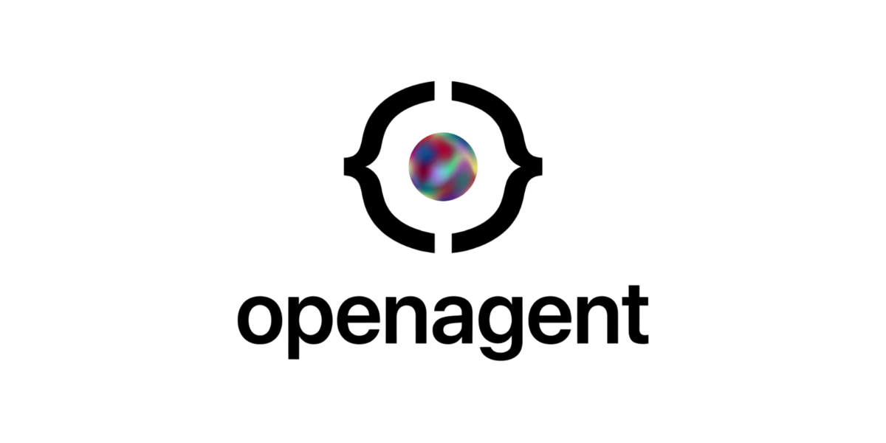
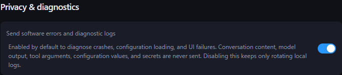

<p align="center">
  
</p>

<div align="center">

**A modern desktop AI agent client — built with Tauri, SvelteKit, and Rust.**

  <p>
    
    
    
    
    
    
    
  </p>

  <p>
    English · <a href="README.zh-CN.md">简体中文</a>
  </p>
</div>

---

## Table of contents

- [Table of contents](#table-of-contents)
- [Changelog](#changelog)
- [Highlights](#highlights)
  - [Agent runtime](#agent-runtime)
  - [Interactive output](#interactive-output)
  - [Tools and integrations](#tools-and-integrations)
  - [Desktop experience](#desktop-experience)
- [Quick Start](#quick-start)
  - [Install a release build](#install-a-release-build)
  - [Prerequisites](#prerequisites)
  - [Clone \& install](#clone--install)
  - [Run in dev mode](#run-in-dev-mode)
  - [Build a distributable](#build-a-distributable)
- [Configure your first provider](#configure-your-first-provider)
  - [Enable web search (optional)](#enable-web-search-optional)
  - [Choose a tool approval mode](#choose-a-tool-approval-mode)
- [Example: write a Skill](#example-write-a-skill)
- [Reusable roles and progressive Skill discovery](#reusable-roles-and-progressive-skill-discovery)
  - [Reusable delegated roles](#reusable-delegated-roles)
  - [Progressive Skill discovery](#progressive-skill-discovery)
- [Interactive prompts with `ask_user`](#interactive-prompts-with-ask_user)
- [AGUI — Inline Interactive Components](#agui--inline-interactive-components)
- [HTML Preview via Tool Call (`render_html`)](#html-preview-via-tool-call-render_html)
- [Memory file format](#memory-file-format)
- [Agent memory controls](#agent-memory-controls)
- [Architecture at a glance](#architecture-at-a-glance)
- [Project structure](#project-structure)
- [Repository activity](#repository-activity)
- [Contributors](#contributors)
- [Contributing](#contributing)
- [Observability (optional)](#observability-optional)
  - [Tool-call structured output integration test](#tool-call-structured-output-integration-test)
- [Further reading](#further-reading)
- [License](#license)

---

## Changelog

See [`CHANGELOG.md`](CHANGELOG.md) for release history and fixes.

---

## Highlights

### Agent runtime

- **Multi-Agent & Flash Agents Architecture** — A primary streaming **Chat Agent** for main conversations, and a suite of dedicated async **Flash Agents** (including **Memory Agent** for long-term memory synthesis, **Title Agent** for dynamic conversation renaming, and **Hook Agent** for background scheduled tasks).
- **Sub-Agent Delegation** — The Chat Agent can call `spawn_agent` to delegate tasks to nested sub-agents; progress streams in real-time into a sub-conversation shown nested under the parent in the sidebar.
- **Reusable Agent Roles** — Create global or project-scoped role workflows, discover them with hybrid search, and dispatch them as specialized child agents. Roles can be created automatically on first use or managed from the **Roles** panel.
- **Goal & Graph Loops (Autonomous Execution)** — Type `/goal` in the chat to run a self-correcting loop directly aiming at the objective. Type `/graph` to first plan a structured DAG task graph (`create_goal_graph_config`) and execute nodes asynchronously with parallel processing. The selected branch's durable checkpoint drives an auto-opening, resizable right panel for Goal to-dos and Graph node dependencies.
- **Hybrid Long-Term Memory** — SQLite + FTS5 + bundled, offline 384-dim embeddings (fastembed `AllMiniLML6V2Q`) blended with time decay for cross-session recall. Before retrieval, an optional Flash task rewrites the latest message into a focused semantic query, so stored memories are matched to intent rather than just wording.
- **Interactive User Prompts (`ask_user`)** — The agent can pause mid-task and surface a structured form to the user — `text`, `select`, `checkbox_group`, `confirm`, `date`, and more. The agent blocks until the user responds, then continues with the collected values. No more one-shot guessing on ambiguous instructions.

### Interactive output

- **AGUI — Inline Interactive Components** — The agent can embed file and URL capsules, ECharts visualisations, source-line previews, and image/video media directly in its prose — all rendered live by the streamdown engine.
- **HTML Preview via Tool Call (`render_html`)** — The agent executes a dedicated `render_html` tool to display sandboxed native HTML previews (mockup pages, layouts, visual components) directly in the conversation stream, with fixed-height or expanded display modes and PNG export.
- **Validated Mermaid Rendering** — A dedicated render tool validates Mermaid source before presenting the diagram, while keeping the source available and supporting fullscreen inspection.

### Tools and integrations

- **MCP-Native** — Connect external MCP servers over HTTP or stdio; tools are injected into the agent at call time.
- **First-class Dev Tools** — Built-in file, search, fetch, and terminal tools. Managed terminal sessions support interactive or long-running background processes; `fetch` retrieves pages locally with Spider, extracts readable text, and supports pagination.
- **Independent Approval & Runtime Permissions** — Choose when tool calls pause for review separately from the managed filesystem and network sandbox.
- **Skills System** — Drop a `SKILL.md` into `~/.agents/skills/` or `<workspace>/.agents/skills/`. Category-based progressive discovery keeps large global and project catalogs compact, with optional Flash classification for uncategorized Skills.
- **Portable Agent Plugins** — Install Agent Plugins 1.0.0 packages from **Settings → Agent Plugins**, with isolated Agent Skill and stdio/Streamable HTTP MCP discovery. See [Agent Plugins](docs/agent-plugins.md).
- **Messaging Channels** — Connect Feishu/Lark, Telegram, QQ, WeChat, Discord, or Slack from **Settings → Channels**. Each peer keeps its own workspace, model, role, and durable conversation, with commands for switching scope and replying to questions or approvals. See [Messaging channels](docs/channels.md).
- **Checkpoints & File-Change Rollback** — Every turn is a checkpoint with reverse diffs; undo a single file or rewind the whole agent.
- **Pluggable LLMs & Multimodal** — Support multi-model selection and durable image, PDF, and text attachments with drag/paste, rich previews, checkpoint restoration, and branch editing across Anthropic, OpenAI, and compatible providers.

### Desktop experience

- **Context Compaction & Tree Conversations** — Automatically or manually compact long conversations into tree structures to save tokens, preserving history lineage via search-based message recall.
- **Responsive Conversation History** — Search and paginate the sidebar, queue follow-up messages during a run, and navigate virtualized transcripts without loading the entire history into the DOM.
- **Scheduled Chat Hooks** — Define recurring or one-off tasks triggered in the background. Hooks are fully persistent, auto-restored on startup, and supported by system tray notifications.
- **Project Drafts & Global/Local Scopes** — Keep drafts, memory, and skills scoped globally (in `~/.openagent`) or locally to your active workspace (in `.agents/`).
- **DESIGN.md & MDX Editor** — Dedicated edit panel for `DESIGN.md` in your workspace, plus a rich markdown editor (MdxMarkdownEditor) integrated into memory and skill management.
- **Multi-Workspace Desktop Integration** — Repeated app launches restore and focus the existing primary window instead of starting another primary instance. Open each workspace in a dedicated window, focus existing workspace windows instead of duplicating them, launch on startup, minimize to the system tray, and reveal workspace locations in the native file manager.
- **Observability** — Optional Langfuse tracing via OpenTelemetry (`gen_ai.*` attributes).
- **Polished UI** — Apple-style design language, streaming markdown, Mermaid & ECharts rendering, light/dark themes, i18n (zh / en).

---

## Quick Start

### Install a release build

Download the latest installer or app bundle from [GitHub Releases](https://github.com/BANG404/openagent/releases). OpenAgent publishes separate **beta**, **RC**, and **stable** update channels; you can also check for updates manually from Settings. Manual checks show progress, time out if the updater endpoint does not respond, and leave the action retryable with visible success or failure feedback.

To build from source instead, continue below.

### Prerequisites

| Tool | Version | Notes                                        |
| ---- | ------- | -------------------------------------------- |
| Bun  | latest  | Package manager — used instead of npm / yarn |
| Rust | 1.70+   | Required for the Tauri backend               |
| Node | 18+     | Used by the SvelteKit toolchain              |

> On Windows the Tauri prerequisites also include WebView2 and the MSVC build tools. See the [official Tauri prerequisites](https://tauri.app/start/prerequisites/) for platform-specific setup.

### Clone & install

```bash
git clone --recurse-submodules https://github.com/BANG404/openagent.git
cd openagent
bun install
```

The runtime SDK is a private submodule. Source builds require access to
`BANG404/openagent-sdk` and an SSH key accepted by GitHub. For an existing
checkout, initialize it with `git submodule update --init --recursive` before
installing or building.

The desktop Cargo workspace also pins the proxy-capable WebSocket forks
required by the audited Codex Windows sandbox revision used by the SDK. Keep
those root-level patches and the compatible `blake3` lock aligned when
advancing the SDK gitlink; Cargo does not inherit patches from a transitive
workspace, and the sandbox policy parser requires its exact hashing version.

### Run in dev mode

```bash
# Full Tauri desktop app (frontend + Rust backend)
bun tauri dev

# OR — frontend only (selects an available port, no Rust)
bun run dev
```

Development commands select an available loopback port. `bun tauri dev` passes that port to Vite so the desktop host and frontend always agree.

Debug desktop builds use `~/.openagent-dev` by default, keeping development
configuration and data separate from an installed release. Set
`OPENAGENT_HOME` explicitly to use another development root.

### Build a distributable

```bash
bun run tauri:build
```

The built installers / app bundle land in `src-tauri/target/release/bundle/`.
On Linux this command builds the pinned Codex Bubblewrap sidecar, strips it,
embeds its SHA-256 in the release binary, and packages the same bytes. Linux
source builds therefore also require `libcap` development headers, `pkg-config`,
and GNU `strip` (usually provided by `binutils`).

---

## Configure your first provider

On first launch OpenAgent creates `config.toml` in its cross-platform user data root (`~/.openagent` on Linux, macOS, and Windows). Set `OPENAGENT_HOME` to override the complete root. Open **Settings → Providers** and add a provider, or edit the file directly; valid external edits hot-reload. See [Configuration and application data](docs/configuration.md) for atomic-save, backup, migration, and conflict behavior. Until an available model is configured, the composer keeps sending disabled and provides a **Configure models** shortcut to Settings.

```toml
config_version = 1

[[providers]]
id = "anthropic-main"
name = "Anthropic"
provider = "anthropic"
api_key = "sk-ant-..."
base_url = "https://api.anthropic.com"
enabled = true

[defaults]
chat_model   = { provider_id = "anthropic-main", model = "claude-sonnet-4-6" }
flash_model  = { provider_id = "anthropic-main", model = "claude-haiku-4-5" }
```

OpenAI-compatible endpoints (DeepSeek, OpenRouter, local Ollama, etc.) work the same — just point `base_url` at the right host and set `provider = "openai"`. You may enter a host, a `/v1` API root, or a full `/chat/completions` URL; OpenAgent normalizes it to the API root.

### Enable web search (optional)

Open **Settings → Web Search** and configure the provider you want to use. The `web_search` tool is available only after the selected provider has the required value: a Brave or Tavily API key, or a SearXNG base URL. The independent `fetch` tool always retrieves a page directly with Spider, returns readable text, and paginates long results according to the configured fetch page size. Omit `page` for the first page and use subsequent 1-based page numbers for the rest. Saving Settings refreshes the tool list immediately.

### Choose a tool approval mode

Use the approval selector in the conversation composer, or open **Settings → General → Approval Mode**, to control when agent tool calls pause for review. Approval defaults to **Off** and is independent from runtime permissions: approving a call never expands its filesystem or network capabilities.

| Mode          | Behavior                                                                                     |
| ------------- | -------------------------------------------------------------------------------------------- |
| **Manual**    | Ask you to approve every tool call.                                                          |
| **Automatic** | A Flash task assesses the impact; important or uncertain calls still come to you for review. |
| **Off**       | Run all tool calls without the approval flow.                                                |

Use **Settings → General → Execution Permissions & Sandbox** for the actual confinement policy. The recommended managed profile offers workspace-writable, read-only, and advanced path-rule presets plus restricted or enabled networking. The default grants host-wide reads and workspace-scoped writes, keeps `.git`, `.agents`, and `.codex` read-only beneath broad writable roots, and restricts network access. External mode delegates isolation to the embedding host; disabled mode explicitly uses ambient process access and displays a warning. Managed terminal processes are isolated with Bubblewrap on Linux, Seatbelt on macOS, and the pinned Codex sandbox on Windows. Missing helpers or failed setup abort the command without falling back to ambient access, and built-in file tools enforce the same canonical filesystem policy independently of the terminal backend.

---

## Example: write a Skill

Create `~/.agents/skills/python-review/SKILL.md`:

```markdown
---
name: python-review
description: Review Python diffs for type-hint coverage, error handling, and PEP 8 compliance.
---

When asked to review Python code:

1. Check that public functions have type hints.
2. Flag bare `except:` clauses and silent failures.
3. Suggest more idiomatic stdlib alternatives where appropriate.
```

That's it — OpenAgent picks it up on the next message and lists it in the agent's system prompt. The agent reads the full body on demand via `read_file`.
OpenAgent also installs the bundled `find-skills` Skill into this global directory when it is missing.
When that Skill is available, the agent receives an explicit reminder to use it proactively for material capability gaps in specialized, complex, or deep work. It reuses installed Skills first, reviews third-party candidates before installation, defaults repository-specific additions to `<workspace>/.agents/skills/`, and reserves `~/.agents/skills/` for capabilities intended to work across unrelated projects.

---

## Reusable roles and progressive Skill discovery

### Reusable delegated roles

Open **Roles** in the sidebar to create and manage specialized workflows such as a code reviewer, release manager, or research assistant. A role contains a stable name plus the responsibilities, boundaries, workflow, and delivery standards appended to the delegated agent's system prompt.

- **Global roles** are reusable in every workspace.
- **Project roles** are visible only in the current workspace.
- The main agent can create a role on first dispatch, find saved roles by name or responsibility, and reuse them in child conversations. The Roles panel shows usage count and last-used time.

### Progressive Skill discovery

For a large Skill catalog, add a category under the frontmatter `metadata` map:

```yaml
---
name: python-review
description: Review Python diffs for correctness and maintainability.
metadata:
  category: code-quality
---
```

OpenAgent initially exposes compact category summaries and loads the matching Skill descriptions on demand. When the optional **Settings → Flash Tasks → Skill Category Task** is enabled, the app categorizes ungrouped Skills in the background after startup or a workspace switch and persists the result to `metadata.category` in each `SKILL.md`.

---

<a id="interactive-prompts-with-ask_user"></a>

## Interactive prompts with `ask_user`

When the agent needs a decision before continuing — ambiguous instruction, technology choice, destructive operation, missing parameter — it calls `ask_user` to surface a structured form in the chat panel. The agent blocks until you respond; everything in the form is typed, so you can select from dropdowns, tick checkboxes, confirm a boolean, or pick a date without typing a sentence.

Supported field types:

| Type             | Use case                     |
| ---------------- | ---------------------------- |
| `text`           | Short free-form input        |
| `textarea`       | Multi-line text              |
| `select`         | Single choice from a list    |
| `checkbox`       | Single on/off toggle         |
| `checkbox_group` | Multiple choices from a list |
| `date`           | Date picker                  |
| `confirm`        | Yes / No decision            |

The agent is guided to ask once, ask clearly, and prefer structured fields over open text boxes.

---

<a id="agui--inline-interactive-components"></a>

## AGUI — Inline Interactive Components

Beyond markdown, the agent can embed interactive components directly in its responses. The frontend's streamdown renderer picks them up and renders them as rich, clickable elements — no copy-pasting paths or URLs needed.

Syntax: `ComponentName(prop: value, prop2: "string")`

| Component | Example                                                | Renders as                                                |
| --------- | ------------------------------------------------------ | --------------------------------------------------------- |
| `File`    | `File(path: "src/tools.rs", lines: "120-140")`         | Clickable chip that opens the file at the given lines     |
| `Url`     | `Url(href: "https://docs.rs/rig", title: "rig docs")`  | Capsule that opens the link in the browser                |
| `Chart`   | `Chart(type: "bar", labels: ["A","B"], data: [10,20])` | ECharts bar / line / pie chart                            |
| `Image`   | `Image(src: "assets/result.png", caption: "Result")`   | Workspace-local or HTTP(S) image with an optional caption |
| `Video`   | `Video(src: "assets/demo.mp4", controls: true)`        | Workspace-local or HTTP(S) video with playback controls   |

Multi-series charts use `series: [{name, data}, ...]`.

---

<a id="html-preview-via-tool-call-render_html"></a>

## HTML Preview via Tool Call (`render_html`)

Instead of writing inline component tags, the agent can execute a dedicated `render_html` tool to display sandboxed HTML previews (such as mockup pages, layouts, or visual components) directly in the conversation stream. The rendered frame uses the HTML as provided without injecting app theme styles, supports a fixed-height window or expanded content height, and includes best-effort PNG download.

---

## Memory file format

Memory files have **two zones**. The Memory Agent only writes below the marker comment:

```markdown
## [User] Personal habits

<!-- You edit freely here; the agent never touches this section -->

## [Agent] Recent context summary

<!-- Memory Agent only operates below this comment -->
```

- Global memory → `~/.openagent/memory.md` (every conversation)
- Local memory → `<workspace>/.agents/memory.md` (workspace-scoped)

## Agent memory controls

Open **Settings → Flash Tasks → Memory Task** to configure the long-term-memory workflow. Both options are enabled by default:

- **Agent memory retrieval** uses the Flash model to turn the current message into a focused query, retrieves relevant structured memory, and adds the results to the chat agent's system prompt. Turn it off when you want retrieval to use the message directly.
- **Personalized new-conversation greeting** runs only when the Memory Agent adds or removes memory. It generates and persists one short, natural greeting; memory may shape its tone or lightly suggest one relevant topic, but is never displayed as a user profile.

Disabling the Memory Agent stops its post-conversation extraction task; the two switches above control their respective follow-up behaviors independently.

---

## Architecture at a glance

```
┌──────────────────────────────┐    typed client/events    ┌──────────────────────────────┐
│   SvelteKit Webview (src/)   │  ◄────────────────────►  │  Private SDK submodule       │
│   components · interaction   │                          │  runtime · backend · transport│
└──────────────────────────────┘                          └──────────────────────────────┘
                 │                                                     │
                 └──────────── thin Tauri host (src-tauri/) ───────────┘
```

See [`AGENTS.md`](AGENTS.md) for the public host/frontend contributor guide.
SDK internals and their contributor documentation are maintained in the
private submodule.

---

## Project structure

```
.
├── src/                      # SvelteKit frontend (Svelte 5 · TypeScript)
│   ├── routes/               # Page components
│   └── lib/                  # Components, stores, streamdown, types
├── src-tauri/                # Tauri adapters, build config, and packaging
├── sdk/                      # Pinned private SDK Git submodule
└── docs/                     # Public design, integration, and release docs
```

---

## Repository activity


---

## Contributors

Thanks goes to these wonderful people:

<a href="https://github.com/BANG404/openagent/graphs/contributors">
  
</a>

---

## Contributing

Contributions are very welcome — feature ideas, bug fixes, and docs improvements alike.

1. Fork the repo and create a branch from `master`.
2. Follow the [Conventional Commits](https://www.conventionalcommits.org/) style — see existing log for the scopes we use (`feat(toast):`, `fix(mermaid):`, `refactor(ui):`, etc.).
3. Run `bun run check`, `bun run lint:actions`, and `cargo check --manifest-path src-tauri/Cargo.toml` before opening a PR.
4. Open a PR — describe **why**, not just **what**.

Project conventions live in [`AGENTS.md`](AGENTS.md); the UI/UX spec lives in [`docs/design.md`](docs/design.md).

---

## Observability

OpenAgent writes daily structured application logs under
`<OPENAGENT_HOME>/logs` and retains the latest 15 files. Privacy-filtered error
diagnostics are sent to the OpenAgent OTLP endpoint by default and can be
disabled immediately in **Settings → General → Privacy & diagnostics**. Remote
logs never include conversations, model output, tool arguments, configuration
values, secrets, raw frontend error messages, or stack traces.



Langfuse model tracing remains optional and separate from application logs.

Drop a `.env` in the project root to enable Langfuse tracing:

```env
LANGFUSE_PUBLIC_KEY=pk-...
LANGFUSE_SECRET_KEY=sk-...
LANGFUSE_HOST=https://cloud.langfuse.com
```

When keys are present, Chat & Memory agent calls are instrumented with `gen_ai.*` OpenTelemetry attributes and exported via batch processor.

### Tool-call structured output integration test

The Rust test suite includes an opt-in integration test that verifies the configured model can produce structured results for title, memory, hook, and context-compaction tasks by calling the task-specific capture tool. Put the test provider settings in the repository root `.env`:

```env
OPENAGENT_STRUCTURED_OUTPUT_TESTS=1
OPENAGENT_STRUCTURED_OUTPUT_MODEL=your-model
OPENAGENT_STRUCTURED_OUTPUT_API_KEY=your-api-key
OPENAGENT_STRUCTURED_OUTPUT_BASE_URL=https://your-provider.example/v1

# Optional Langfuse tracing
LANGFUSE_PUBLIC_KEY=pk-...
LANGFUSE_SECRET_KEY=sk-...
LANGFUSE_HOST=https://cloud.langfuse.com
```

Then run:

```bash
cd src-tauri
cargo test env_configured_provider_supports_all_structured_output_tasks -- --nocapture
```

See [`.env.example`](.env.example) for a copyable template. The test defaults to the OpenAI-compatible provider, so `OPENAGENT_STRUCTURED_OUTPUT_MODEL`, `OPENAGENT_STRUCTURED_OUTPUT_API_KEY`, and `OPENAGENT_STRUCTURED_OUTPUT_BASE_URL` are enough for third-party OpenAI-compatible chat endpoints.

For Anthropic, set `OPENAGENT_STRUCTURED_OUTPUT_PROVIDER=anthropic` and provide `ANTHROPIC_API_KEY`.

---

## Further reading

- [`AGENTS.md`](AGENTS.md) — Public host and frontend contributor guide
- [`CHANGELOG.md`](CHANGELOG.md) — Full release history
- [`docs/agent-plugins.md`](docs/agent-plugins.md) — Portable Agent Plugin installation, validation, components, and data boundaries
- [`docs/channels.md`](docs/channels.md) — Messaging platform setup, scoped commands, interrupt replies, persistence, and security
- [`docs/release.md`](docs/release.md) — Versioning, beta/RC/stable channels, and publishing workflow
- [`docs/embedding-model.md`](docs/embedding-model.md) — Bundled model provenance, size, and verification
- [`docs/harness-sdk.md`](docs/harness-sdk.md) — Headless third-party harness integration without publishing the core runtime
- [`docs/design.md`](docs/design.md) — Apple-style design spec
- [Tauri docs](https://tauri.app/) · [SvelteKit docs](https://kit.svelte.dev/) · [rig (Rust LLM)](https://github.com/0xPlaygrounds/rig)

---

## License

OpenAgent is dual-licensed:

- **Open-source option:** [GNU GPL v3.0 or later](LICENSE) (`GPL-3.0-or-later`).
  If you distribute OpenAgent or a derivative work under this option, the GPL
  requires the corresponding source and GPL freedoms to be provided under its
  terms; it does not allow a derivative work to be distributed as proprietary.
- **Commercial option:** a separate [commercial license](COMMERCIAL_LICENSE.md)
  is available for organizations that need to distribute a proprietary
  derivative work or otherwise need rights outside the GPL.

Commercial licensing is provided only through a separate written agreement.
The OpenAgent name and branding remain subject to
[TRADEMARKS.md](TRADEMARKS.md).
