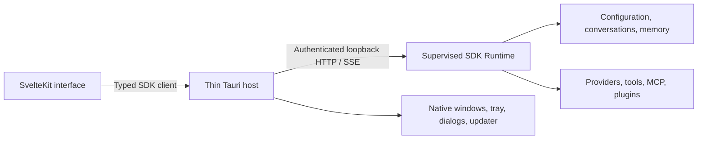

<p align="center">
  
</p>

<h1 align="center">OpenAgent</h1>

<p align="center">
  A desktop AI agent for working with files, tools, and long-running tasks in your workspace.
</p>

<p align="center">
  English · <a href="README.zh-CN.md">简体中文</a><br />
  <a href="https://github.com/BANG404/openagent/releases">Downloads</a> ·
  <a href="CHANGELOG.md">Changelog</a> ·
  <a href="AGENTS.md">Contributor guide</a>
</p>

OpenAgent combines a streaming chat interface with an agent that can inspect projects, edit files, run commands, and use external tools. Choose your model service and workspace, keep conversation history and application data on your device, and extend the agent with skills, roles, MCP servers, and plugins.

The desktop application targets Windows, macOS, and Linux. It uses Svelte 5 with SvelteKit 2 for the interface, Tauri 2 for the native shell, and a Rust Runtime maintained in the pinned private SDK. The project is under active development; source access to the public host does not include access to the private SDK.

## What you can do

| Capability | Current behavior |
| --- | --- |
| Work in a project | Read and patch files, inspect images, run terminal commands, and follow interactive or background terminal sessions. |
| Continue complex work | Delegate to child agents, reuse specialized roles, queue follow-up messages, and retain conversation branches and compacted context. |
| Schedule a continuation | Ask the agent to arrange a timed wake or a supported completion-condition wake, then list or cancel pending hooks through its tools. |
| Review and recover | Inspect tool calls and file changes, answer structured questions, approve calls when configured, and roll back files or conversation checkpoints. |
| Read rich results | Stream Markdown, highlighted code, validated Mermaid diagrams, ECharts charts, file/link capsules, and image/video output; open long replies in book mode. |
| Keep useful context | Use global and workspace memory, local semantic retrieval, reusable skills, and background Flash tasks for titles, memory, and suggestions. |
| Extend the agent | Connect MCP services, install Agent Plugins, and use package-provided commands, tools, skills, automation, and sidebar or conversation UI. |
| Reach it remotely | Connect supported messaging platforms or pair a browser with the remote gateway. |

Image, PDF, and text attachments support drag/paste, previews, checkpoint restoration, and branch editing. Actual model and attachment capabilities depend on the selected provider and model.

## Install and start

Download an installer or application bundle for your platform from [GitHub Releases](https://github.com/BANG404/openagent/releases). Choose a release that includes desktop installers; component-only releases update an existing installation.

- **Full bundle:** includes the local embedding model seed and is suitable for a first installation.
- **Lightweight bundle:** downloads and verifies that model during setup. Automatic desktop updates use lightweight artifacts and preserve the installed model.

On first launch, the setup window guides you through preferences, a model service, default models, and resource readiness. Select a workspace folder, enter your service credentials and endpoint, verify the connection, and choose the Chat and Flash models. Chat handles the main conversation; Flash handles smaller background tasks. Sending remains disabled until an available chat model is configured.

You can change services and defaults later from the **Models** menu. OpenAgent supports Anthropic, OpenAI, and compatible services, including custom endpoints. For an OpenAI-compatible service, the endpoint may be a host, a `/v1` root, or a full `/chat/completions` URL; the application normalizes it to the API root.

## Approvals and execution permissions

The composer offers an approval selector. The **Agent → Execution & Permissions** surface configures approval and sandbox policy separately.

| Approval mode | Behavior |
| --- | --- |
| Manual | Requests review for tool calls, except explicitly exempt lifecycle controls. |
| Automatic | A Flash task assesses each proposed call; consequential or uncertain calls require review. |
| Off | Runs calls without the approval flow. This is the default approval mode. |

Approval never expands filesystem or network access. The default managed profile permits host-wide reads and workspace-scoped writes, keeps `.git`, `.agents`, and `.codex` read-only beneath broad writable roots, and restricts networking. Read-only presets and explicit path rules are also available. Disabled isolation uses the application's ambient process access.

Managed terminals use Bubblewrap on Linux, Seatbelt on macOS, and the pinned Codex sandbox on Windows. Built-in file tools enforce the same filesystem policy. Missing helpers or failed sandbox setup stop execution. See the [permissions contract](.agents/skills/openagent-configuration/references/permissions.md) for the exact rules.

## Skills, roles, and plugins

A **skill** is a reusable instruction file. Place `SKILL.md` in either `~/.agents/skills/<name>/` for global use or `<workspace>/.agents/skills/<name>/` for project use:

```markdown
---
name: python-review
description: Review Python changes for error handling, type hints, and maintainability.
metadata:
  category: code-review
---

Read the changed code and report actionable findings with file locations.
Prioritize incorrect behavior, silent failures, and missing error handling.
```

Skills are discovered progressively and their full instructions are loaded when relevant. **Roles** store reusable agent workflows and can be selected for conversations or delegated work.

Open **Integrations → Extensions** to manage external MCP services and **Integrations → Plugins** to browse or manage Agent Plugins. The official catalog includes Goal, Graph, Chat Groups, Cua Driver, Message Board, and Plugin Developer. Plugins can provide commands, MCP tools, skills, lifecycle automation, and embedded UI. Cua Driver provides desktop automation and requires an explicit host-access grant.

Goal, Graph, and Chat Groups own their workflows inside their packages. Child-agent coordination is a Runtime capability. Plugin versions and updates are independent of the desktop version. For package authoring and local source setup, start with the [plugin development skill](.agents/skills/openagent-plugin-development/SKILL.md).

## Memory and local data

Application configuration and durable data use one root:

| Scope | Location |
| --- | --- |
| Installed application | `~/.openagent/` on every supported platform |
| Debug desktop | `~/.openagent-dev/` |
| Explicit application root | The directory selected by `OPENAGENT_HOME` |
| Global user memory | `<OPENAGENT_HOME>/memory.md` |
| Workspace memory | `<workspace>/.agents/memory.md` |
| Global / project skills | `~/.agents/skills/` / `<workspace>/.agents/skills/` |
| Workspace design context | `<workspace>/DESIGN.md` |

The application root contains `config.toml`, the conversation SQLite database, attachments, logs, installed plugins, plugin data, and versioned resources. Valid external configuration edits reload automatically. The Runtime owns persistence, backup, and migration behavior; see [configuration and application data](.agents/skills/openagent-configuration/references/data-and-startup.md).

User memory supplies standing context. Structured agent memory is stored separately and supports local hybrid text/vector retrieval. Manage the background memory task and retrieval controls under **Agent → Flash Tasks**; automatic retrieval is disabled by default. The **Memory** surface manages user and agent memory.

Local storage does not make model requests offline: prompts, selected context, and attachments are sent to the configured model service. MCP services and plugins may also contact their configured services.

## Messaging and browser access

**Integrations → Channels** supports Feishu/Lark, Telegram, QQ, WeChat, Discord, and Slack. Each peer keeps a durable conversation and its own workspace, model, and role selection. Current channel messaging supports text; setup, allowlists, and commands are documented in [messaging channels](.agents/skills/openagent-channel-integrations/references/messaging-channels.md).

The same surface offers the **Gateway** for paired browser access. Enable it, explicitly allow a workspace, and pair using the displayed one-time code. Remote users can work with conversations, attachments, approvals, questions, and branches while the desktop remains running. Remote access and direct LAN access are disabled by default; provider administration and unrestricted desktop operations stay local. See the [remote gateway guide](.agents/skills/openagent-channel-integrations/references/remote-gateway.md) for connection and security details.

## Updates and diagnostics

OpenAgent has Beta, RC, and Stable update channels. The frontend, supervised Runtime, native shell, and installed plugins have separate delivery boundaries. Component updates are verified before activation; frontend and Runtime activation support rollback. Updates wait for active agent work to finish, and a native-shell update requires an application restart. See the [component update contract](.agents/skills/openagent-update-delivery/references/component-updates.md).

Local host and Runtime logs live in `<OPENAGENT_HOME>/logs`, with up to 15 files retained per rolling log family. Privacy-filtered remote error collection is enabled by default and can be turned off in **General → Privacy & diagnostics**. It excludes conversation content, prompts, model output, tool arguments, credentials, and raw frontend errors. Optional Langfuse model tracing is separate and may contain model context; its environment variables are listed in [`.env.example`](.env.example). See the [diagnostics contract](.agents/skills/openagent-configuration/references/diagnostics.md).

## Develop from source

### Requirements

- Git and access to the private `BANG404/openagent-sdk` repository. Its submodule URL uses SSH, so configure an authorized SSH key.
- Bun **1.2.21**, matching `package.json` and CI, plus Node.js for scripts that explicitly invoke `node`.
- A current stable Rust toolchain and the native build dependencies for Tauri 2 on your platform. Windows requires MSVC build tools and WebView2; Linux sandbox-helper builds additionally need `libcap` development headers, `pkg-config`, and GNU `strip`.

Dependency versions are pinned by the lockfiles; use the stable Rust toolchain used by native CI. Read the [local development guidance](.agents/skills/openagent-release-engineering/references/local-commands.md) and, on Windows, the [setup guide](.agents/skills/openagent-windows-development/references/setup-and-sync.md).

```bash
git clone --recurse-submodules https://github.com/BANG404/openagent.git
cd openagent
bun run prepare:worktree:dev
bun tauri dev
```

Preparation initializes the pinned submodules, installs frozen dependencies, and builds the development sandbox helpers and Runtime sidecar. Existing checkouts use the same preparation command. Source builds require the private SDK; users without access can install published desktop builds.

| Command | Purpose |
| --- | --- |
| `bun tauri dev` | Start the desktop with Vite and a supervised external Runtime. |
| `bun run dev` | Frontend-only development on an available loopback port; provides no desktop Runtime. |
| `bun run tauri:dev:embedded` | Explicit embedded-Runtime diagnostic mode. |
| `bun run preflight` | Select and run checks for the actual changed files. |
| `bun run preflight --dry-run` | Inspect the check plan. |
| `bun run tauri:build` | Build the lightweight desktop installer and updater artifact. |
| `bun run tauri:build:full` | Build a first-install bundle with the embedding seed. |

Development uses an available Vite port and isolated application data. The launcher gives each worktree/data fixture a separate native development target directory; Runtime and helper output remain under `sdk/target`. SDK source changes rebuild the sidecar before the host restarts. See [development Runtime refresh](.agents/skills/openagent-release-engineering/references/development-runtime.md).

### Architecture and repository layout


```mermaid
flowchart LR
  UI["SvelteKit interface"] -->|"Typed SDK client"| Host["Thin Tauri host"]
  Host -->|"Authenticated loopback HTTP / SSE"| Runtime["Supervised SDK Runtime"]
  Host --> Native["Native windows, tray, dialogs, updater"]
  Runtime --> Data["Configuration, conversations, memory"]
  Runtime --> Tools["Providers, tools, MCP, plugins"]
```

| Path | Ownership |
| --- | --- |
| `src/` | Svelte routes, feature controllers, components, localization, and streamed rendering. |
| `src-tauri/` | Native host adapters, resource protocols, process supervision, and packaging. |
| `sdk/` | Pinned private Runtime and typed transport/client source. |
| `plugins/` | Pinned independent plugin repositories and the local development index. |
| `scripts/`, `tests/` | Preparation, checks, release automation, and deterministic verification. |
| `.agents/skills/` | Focused architecture contracts and contributor workflows. |

The host remains thin; runtime state machines and durable data belong to the SDK. The public frontend and host can be contributed to separately, but complete source builds need the pinned private dependencies.

### Contribute

Read [`AGENTS.md`](AGENTS.md) and the applicable subsystem skill before editing. Repository changes use [isolated OWT worktrees](.agents/skills/deliver-via-owt/SKILL.md): preserve the default checkout on local `master`, implement and verify in a task worktree, then fast-forward the verified result back. Inspect the complete diff, stage intended files, and run `bun run preflight` before a Conventional Commit.

Update the primary owner documentation when behavior changes. Visible desktop changes also require the matching real-window [native black-box scenario](.agents/skills/openagent-desktop-host/references/native-verification.md). SDK and plugin changes follow their own repository instructions before the parent gitlink is advanced.

For runtime model checks, use the SDK-owned instructions and [`.env.example`](.env.example). `bun run test:sonar` runs the host and SDK test gates before submitting analysis to the locally configured SonarQube instance.

## License

OpenAgent is available under [GPL-3.0-or-later](LICENSE), with a separate [commercial licensing option](COMMERCIAL_LICENSE.md). Commercial rights require a written agreement. The project name and branding are covered by [TRADEMARKS.md](TRADEMARKS.md).
