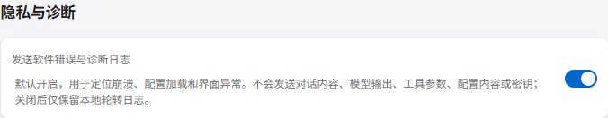

<p align="center">
  
</p>

<div align="center">
 

  **现代化桌面 AI Agent 客户端 — 基于 Tauri、SvelteKit 与 Rust 构建。**

  <p>
    
    
    
    
    
    
    
  </p>

  <p>
    <a href="README.md">English</a> · 简体中文
  </p>
</div>

---

## 目录

- [目录](#目录)
- [更新日志](#更新日志)
- [核心特性](#核心特性)
  - [Agent 运行时](#agent-运行时)
  - [交互式输出](#交互式输出)
  - [工具与集成](#工具与集成)
  - [桌面体验](#桌面体验)
- [快速开始](#快速开始)
  - [安装发行版](#安装发行版)
  - [前置依赖](#前置依赖)
  - [克隆与安装](#克隆与安装)
  - [开发模式启动](#开发模式启动)
  - [构建发行版](#构建发行版)
- [配置第一个 Provider](#配置第一个-provider)
  - [启用网络搜索（可选）](#启用网络搜索可选)
  - [选择工具审批模式](#选择工具审批模式)
- [示例：编写一个技能](#示例编写一个技能)
- [可复用角色与技能渐进发现](#可复用角色与技能渐进发现)
  - [可复用委派角色](#可复用委派角色)
  - [技能渐进发现](#技能渐进发现)
- [与用户交互：`ask_user` 工具](#与用户交互ask_user-工具)
- [AGUI — 行内交互式 UI 组件](#agui--行内交互式-ui-组件)
- [通过工具调用渲染 HTML 预览 (`render_html`)](#通过工具调用渲染-html-预览-render_html)
- [记忆文件格式](#记忆文件格式)
- [Agent 记忆控制](#agent-记忆控制)
- [架构概览](#架构概览)
- [项目结构](#项目结构)
- [仓库活跃度](#仓库活跃度)
  - [Star 历史](#star-历史)
- [贡献者](#贡献者)
- [路线图](#路线图)
- [贡献指南](#贡献指南)
- [可观测性（可选）](#可观测性可选)
- [延伸阅读](#延伸阅读)
- [许可证](#许可证)

---

## 更新日志

完整版本历史与修复列表见 [`CHANGELOG.md`](CHANGELOG.md)。

---

## 核心特性

### Agent 运行时

- **多 Agent 与 Flash Agent 架构** — 负责主对话流的流式 **Chat Agent**，以及一套专门的异步任务 **Flash Agents**（包含用于长期记忆提炼的 **Memory Agent**、用于对话标题自动生成的 **Title Agent**、以及用于执行后台定时任务的 **Hook Agent**）。
- **子 Agent 委派** — Chat Agent 可通过 `spawn_agent` 工具将子任务委派给嵌套子 Agent；进度实时流式输出，并以层级方式显示在侧边栏父对话下方。
- **可复用 Agent 角色** — 创建全局或项目范围的角色工作流，通过混合搜索发现角色，并派发为专业子 Agent。角色既可在首次使用时由主 Agent 自动创建，也可在**角色**面板中管理。
- **目标与任务图自主执行 (Goal & Graph Loops)** — 在对话框中输入 `/goal` 即可启动以目标为导向、自动迭代的执行循环；输入 `/graph` 可以针对复杂任务先规划生成一个结构化的任务依赖图（`create_goal_graph_config`），并支持并发或异步地按步骤执行各节点任务，在前端展示实时的任务图执行进度。
- **混合长期记忆** — SQLite + FTS5 + 随安装包提供、可离线运行的 384 维量化向量嵌入（fastembed `AllMiniLML6V2Q`），结合时间衰减权重实现跨会话精准召回。检索前可选用 Flash 任务将最新消息改写为聚焦的语义查询，使记忆匹配意图而不只依赖原始措辞。
- **交互式用户提问（`ask_user`）** — Agent 在任务中途可暂停并向用户弹出结构化表单——支持 `text`、`select`、`checkbox_group`、`confirm`、`date` 等多种字段类型。Agent 阻塞等待用户提交后继续执行，彻底告别单次猜测模糊指令的窘境。

### 交互式输出

- **AGUI — 行内交互式 UI 组件** — Agent 可以在回复中直接嵌入文件与链接胶囊、ECharts 图表、源代码行预览以及图片/视频媒体，均由 streamdown 引擎实时渲染。
- **通过工具调用渲染 HTML 预览 (`render_html`)** — Agent 可以通过调用内置的 `render_html` 工具，在对话流中直接渲染沙箱化的原生 HTML 预览（例如原型页面、UI 布局、交互组件等），支持固定高度或展开显示，并可导出/下载为 PNG 图像。
- **Mermaid 校验渲染** — 专用渲染工具会在展示前校验 Mermaid 源码，同时保留原始源码并支持全屏查看。

### 工具与集成

- **原生 MCP 集成** — 通过 HTTP 或 stdio 连接外部 MCP 服务器，工具在调用时动态注入 Agent。
- **开箱即用的开发工具** — 内置文件、搜索、抓取与终端工具。受管终端会话支持交互式或长时间运行的后台进程；`fetch` 通过 Spider 在本地获取页面、提取可读文本并支持分页。
- **工具审批与工作区沙盒** — 可选择逐次人工审批、模型辅助审批、关闭审批，或仅针对文件与终端工具的工作区沙盒策略。
- **技能系统（Skills）** — 将 `SKILL.md` 放入 `~/.agents/skills/` 或 `<workspace>/.agents/skills/`。基于分类的渐进发现让大型全局/项目技能目录保持紧凑，也可用 Flash 任务为未分类技能自动分组。
- **检查点与文件回滚** — 每轮对话自动创建检查点并记录反向 diff，支持单文件还原或整轮回滚。
- **多 LLM 与多模态支持** — 支持多模型选择，以及可持久恢复的图片、PDF 和文本附件；提供拖拽/粘贴、丰富预览、检查点恢复与分支编辑，适配 Anthropic、OpenAI 及各类兼容端点。

### 桌面体验

- **上下文压缩与树状对话** — 支持自动或手动对话压缩以节省 Token 消耗，并在 UI 中渲染为树状分支，结合基于谱系的消息检索，确保历史记忆不丢失。
- **高响应对话历史** — 可搜索和分页浏览侧边栏，在运行期间排队发送后续消息，并通过虚拟化消息列表流畅导航长对话。
- **定时聊天钩子（Scheduled Hooks）** — 支持配置定时或单次后台触发的聊天任务，支持持久化、开机自动恢复以及系统托盘通知。
- **项目草稿与全局/本地作用域** — 支持草稿（Drafts）、记忆（Memory）与技能（Skills）的全局作用域（`~/.openagent`）和本地工作区作用域（`.agents/`）隔离。
- **DESIGN.md 面板与 MDX 编辑器** — 提供工作区 `DESIGN.md` 专属可视化编辑面板，并在记忆和技能管理中集成富文本 Markdown 编辑器（MdxMarkdownEditor）。
- **多工作区桌面集成** — 每个工作区使用独立窗口，已有工作区窗口会被聚焦而非重复打开；同时支持开机自启、最小化到系统托盘及在文件管理器中定位工作区。
- **可观测性** — 通过 OpenTelemetry 接入 Langfuse 追踪（含 `gen_ai.*` 属性）。
- **精致 UI** — Apple 风格设计语言，流式 Markdown 渲染，支持 Mermaid 图表与 ECharts，亮暗主题，中英双语界面。

---

## 快速开始

### 安装发行版

从 [GitHub Releases](https://github.com/BANG404/openagent/releases) 下载最新安装包或应用包。OpenAgent 分别提供 **beta** 与 **stable** 更新渠道，也可在设置中手动检查更新。手动检查会显示进度；更新源无响应时会超时，并以可见的成功或失败提示恢复为可重试状态。

如需从源码构建，请继续执行以下步骤。

### 前置依赖

| 工具 | 版本 | 说明 |
|------|------|------|
| [Bun](https://bun.sh) | 最新 | 包管理器（代替 npm / yarn） |
| [Rust](https://rustup.rs) | 1.70+ | Tauri 后端编译所需 |
| [Node.js](https://nodejs.org) | 18+ | SvelteKit 工具链依赖 |

> **Windows** 还需要 WebView2 和 MSVC 构建工具；**macOS** 需要 Xcode Command Line Tools；**Linux** 需要 `webkit2gtk`、`libgtk-3`。详见 [Tauri 官方先决条件](https://tauri.app/start/prerequisites/)。

### 克隆与安装

```bash
git clone --recurse-submodules https://github.com/BANG404/openagent.git
cd openagent
bun install
```

运行时 SDK 是私有子模块。从源码构建需要拥有 `BANG404/openagent-sdk` 的访问权限，
并配置 GitHub 可接受的 SSH 密钥。已有工作区请先运行
`git submodule update --init --recursive`，再安装依赖或构建。

### 开发模式启动

```bash
# 完整 Tauri 桌面应用（前端 + Rust 后端）
bun tauri dev

# 或仅启动前端（端口 14221，不含 Rust）
bun run dev
```

### 构建发行版

```bash
bun tauri build
```

构建产物位于 `src-tauri/target/release/bundle/`。

---

## 配置第一个 Provider

首次启动时，OpenAgent 会在所有平台统一使用的 `~/.openagent/config.toml` 创建配置文件；可通过 `OPENAGENT_HOME` 覆盖整个应用状态根目录。
打开 **设置 → Providers** 添加提供商，或直接编辑该文件。尚未配置可用模型时，输入框会禁用发送，并提供跳转到设置的“配置模型”入口：

```toml
[[providers]]
id = "anthropic-main"
name = "Anthropic"
provider = "anthropic"
api_key = "sk-ant-..."
base_url = "https://api.anthropic.com"
enabled = true

[defaults]
chat_model  = { provider_id = "anthropic-main", model = "claude-sonnet-4-6" }
flash_model = { provider_id = "anthropic-main", model = "claude-haiku-4-5" }
```

兼容 OpenAI API 的端点（DeepSeek、OpenRouter、本地 Ollama 等）同样适用——只需将 `base_url` 指向对应地址，并设置 `provider = "openai"`。`base_url` 可填写主机地址、`/v1` API 根路径或完整的 `/chat/completions` 地址；OpenAgent 会自动规范化为 API 根路径。

### 启用网络搜索（可选）

打开 **设置 → Web Search**，配置要使用的服务。只有所选服务具备必要配置后，Agent 才会获得 `web_search` 工具：Brave 或 Tavily 需要 API Key，SearXNG 需要基础 URL。独立的 `fetch` 工具始终可用，它会通过 Spider 直接获取页面并返回可读文本；长内容按配置的获取页大小分页。省略 `page` 即获取第 1 页，后续页面使用从 1 开始的页码。保存设置后，工具列表会立即刷新。

### 选择工具审批模式

打开 **设置 → 常规设置 → 审批模式**，控制 Agent 如何执行工具调用。当调用需要你确认时，OpenAgent 会暂停对话、展示准确的工具名称和参数，并在你批准或拒绝后继续执行。

| 模式 | 行为 |
| --- | --- |
| **人工审批** | 每次工具调用都需要你确认。 |
| **自动审批** | Flash 任务会评估调用影响；重要或不确定的调用仍会交由你审批。 |
| **关闭审批** | 所有工具调用直接执行，不进入审批流程。 |
| **沙盒模式**（默认） | 仅对文件管理和终端工具应用工作区策略：工作区内操作放行，试图越出工作区的操作会被拒绝。其他内置工具和 MCP 工具保持其正常行为。 |

---

## 示例：编写一个技能

创建文件 `~/.agents/skills/python-review/SKILL.md`：

```markdown
---
name: python-review
description: 检查 Python 代码改动中的类型注解覆盖率、错误处理和 PEP 8 规范。
---

当被要求 Review Python 代码时：
1. 检查公开函数是否有类型注解。
2. 标记裸 `except:` 子句和静默失败。
3. 在合适时建议使用更地道的标准库替代方案。
```

完成！OpenAgent 在下次对话时自动识别该技能，并在系统提示中列出其名称与描述；Agent 会在需要时通过 `read_file` 加载完整内容。
如果全局目录中尚不存在，OpenAgent 还会自动安装内置的 `find-skills` 技能。

---

## 可复用角色与技能渐进发现

### 可复用委派角色

在侧边栏打开**角色**，即可创建和管理代码审查员、发布经理或研究助手等专业工作流。角色由稳定名称与职责、边界、执行方式和交付标准组成，这些内容会追加到被委派 Agent 的系统提示词中。

- **全局角色**可在所有工作区复用。
- **项目角色**仅在当前工作区可见。
- 主 Agent 可在首次派发时创建角色，按名称或职责搜索已保存角色，并在子对话中复用。角色面板还会显示调用次数与最近调用时间。

### 技能渐进发现

当技能目录较大时，可在 frontmatter 的 `metadata` 中声明分类：

```yaml
---
name: python-review
description: 检查 Python 代码改动的正确性与可维护性。
metadata:
  category: code-quality
---
```

OpenAgent 会先向 Agent 提供紧凑的分类摘要，再按需加载匹配分类中的技能说明。启用可选的**设置 → Flash 任务 → 技能分类任务**后，应用会在启动或切换工作区时于后台为未声明分类的技能自动分组，并将结果写入 `SKILL.md` 的 `metadata.category`。

---

<a id="与用户交互ask_user-工具"></a>

## 与用户交互：`ask_user` 工具

Agent 在任务中途遇到需要用户决策的情况时——指令存在歧义、关键技术选型、即将进行不可逆操作、缺少必要参数——会调用 `ask_user` 在对话面板中弹出一个结构化表单。Agent 阻塞等待，用户填写提交后任务继续执行。

支持的字段类型：

| 类型 | 适用场景 |
| --- | --- |
| `text` | 简短的自由文本输入 |
| `textarea` | 多行文本 |
| `select` | 从列表中单选 |
| `checkbox` | 单个开关（是/否） |
| `checkbox_group` | 从列表中多选 |
| `date` | 日期选择 |
| `confirm` | 二选一确认（Yes / No） |

Agent 被要求**一次性问清楚**所有相关问题，并优先使用结构化字段（勾选、下拉）而非让用户手敲文字，减少来回打扰。

---

<a id="agui--行内交互式-ui-组件"></a>

## AGUI — 行内交互式 UI 组件

除了普通 Markdown，Agent 可以在回复中直接嵌入交互式 UI 组件。前端的 streamdown 渲染引擎负责将其渲染为可点击、可视化的富文本元素。

语法：`ComponentName(prop: value, prop2: "字符串")`

| 组件 | 示例 | 渲染效果 |
| --- | --- | --- |
| `File` | `File(path: "src/tools.rs", lines: "120-140")` | 可点击的文件胶囊，直接跳转到对应行 |
| `Url` | `Url(href: "https://docs.rs/rig", title: "rig 文档")` | 外链胶囊，点击在浏览器打开 |
| `Chart` | `Chart(type: "bar", labels: ["A","B"], data: [10,20])` | ECharts 柱状图 / 折线图 / 饼图 |
| `Image` | `Image(src: "assets/result.png", caption: "结果")` | 工作区本地或 HTTP(S) 图片，可附带说明 |
| `Video` | `Video(src: "assets/demo.mp4", controls: true)` | 工作区本地或 HTTP(S) 视频，可显示播放控件 |

多系列图表使用 `series: [{name, data}, ...]`。

---

<a id="通过工具调用渲染-html-预览-render_html"></a>

## 通过工具调用渲染 HTML 预览 (`render_html`)

Agent 不再使用行内 AGUI 标签，而是可以通过调用内置的 `render_html` 工具，在对话流中直接渲染沙箱化的 HTML 预览（例如原型页面、UI 布局、交互组件等）。渲染的 Frame 按原始 HTML 显示，不注入应用主题样式，支持固定高度窗口或展开为内容高度，并支持一键导出/下载为 PNG 图像。

---

## 记忆文件格式

记忆文件分为**两个区域**，Memory Agent 只在标记注释以下进行写入：

```markdown
## [用户手写] 个人习惯
<!-- 此区域由用户自由编辑；Agent 永远不会修改此部分 -->

## [Agent 维护] 近期上下文摘要
<!-- Memory Agent 仅在此注释以下进行操作 -->
```

- **全局记忆** → `~/.openagent/memory.md`（注入每次对话）
- **工作区记忆** → `<workspace>/.agents/memory.md`（仅在对应工作区生效）

## Agent 记忆控制

打开 **设置 → Flash 任务 → 记忆任务** 可配置长期记忆流程。以下两项默认开启：

- **Agent 记忆检索**：使用 Flash 模型将当前消息改写为聚焦查询，检索相关的结构化记忆，并将结果加入 Chat Agent 的系统提示词。关闭后会直接使用原始消息进行检索。
- **新对话个性化开场白**：仅在 Memory Agent 新增或删除记忆时运行，生成并持久化一句自然简短的问候；记忆只用于调整语气或轻点一个相关话题，不会作为用户画像展示。

关闭 Memory Agent 会停止对话结束后的记忆提取任务；以上两个开关分别控制对应的后续行为。

---

## 架构概览

```
┌──────────────────────────────┐     类型化客户端/事件     ┌──────────────────────────────┐
│   SvelteKit Webview (src/)   │  ◄────────────────────►  │  私有 SDK 子模块             │
│   组件与交互状态             │                          │  运行时、后端与传输层         │
└──────────────────────────────┘                          └──────────────────────────────┘
                 │                                                     │
                 └──────────── Tauri 薄宿主（src-tauri/）──────────────┘
```

公开宿主与前端的贡献说明参见 [`AGENTS.md`](AGENTS.md)。SDK 内部架构及其贡献
文档统一维护在私有子模块中。

---

## 项目结构

```
.
├── src/                      # SvelteKit 前端（Svelte 5 · TypeScript）
│   ├── routes/               # 页面组件
│   └── lib/                  # 组件、状态、streamdown 渲染器、类型定义
├── src-tauri/                # Tauri 薄宿主、构建配置与打包元数据
├── sdk/                      # 固定版本的私有 SDK Git 子模块
└── docs/                     # 公开设计、集成与发布文档
```

---

## 仓库活跃度


### Star 历史

<a href="https://star-history.com/#BANG404/openagent&Date">
  
</a>

---

## 贡献者

感谢所有参与贡献的人：

<a href="https://github.com/BANG404/openagent/graphs/contributors">
  
</a>

---

## 路线图

- [ ] 在 README 中补充截图与演示 GIF
- [x] 通过 GitHub Releases 提供预构建安装包（beta / stable 渠道）
- [ ] 应用内技能市场
- [x] 多工作区独立窗口

欢迎在 [Issues](https://github.com/BANG404/openagent/issues) 查看完整待办事项，也欢迎提交新需求。

---

## 贡献指南

欢迎各种形式的贡献——功能建议、Bug 修复或文档改进。

1. Fork 本仓库并从 `master` 创建分支。
2. 遵循 [Conventional Commits](https://www.conventionalcommits.org/) 风格——参考现有提交日志了解使用的 scope（`feat(toast):`、`fix(mermaid):`、`refactor(ui):` 等）。
3. 提交 PR 前运行 `bun run check`、`bun run lint:actions` 和 `cargo check --manifest-path src-tauri/Cargo.toml`。
4. 在 PR 描述中说明**为什么**，而不仅是做了什么。

项目约定详见 [`AGENTS.md`](AGENTS.md)；UI/UX 规范详见 [`docs/design.md`](docs/design.md)。

---

## 可观测性

OpenAgent 会在 `<OPENAGENT_HOME>/logs` 下按天写入结构化应用日志，并保留最近
15 个文件。经过隐私筛选的错误诊断默认发送到 OpenAgent OTLP 端点，可在
**设置 → 通用 → 隐私与诊断**中即时关闭。远程日志不会包含对话、模型输出、工具参数、
配置值、密钥、前端原始错误消息或堆栈。



Langfuse 模型追踪与应用日志相互隔离，并保持可选：

在项目根目录创建 `.env` 文件以启用 Langfuse 追踪：

```env
LANGFUSE_PUBLIC_KEY=pk-...
LANGFUSE_SECRET_KEY=sk-...
LANGFUSE_HOST=https://cloud.langfuse.com
```

配置后，Chat Agent 和 Memory Agent 的每次调用都会生成带有 `gen_ai.*` OpenTelemetry 属性的 span，并通过批量处理器导出。

---

## 延伸阅读

- [`AGENTS.md`](AGENTS.md) — 公开宿主与前端贡献指南
- [`CHANGELOG.md`](CHANGELOG.md) — 完整版本历史
- [`docs/release.md`](docs/release.md) — 版本规则、beta/stable 渠道与发布流程
- [`docs/embedding-model.md`](docs/embedding-model.md) — 随包模型的来源、大小与校验方式
- [`docs/design.md`](docs/design.md) — Apple 风格 UI 设计规范
- [Tauri 文档](https://tauri.app/) · [SvelteKit 文档](https://kit.svelte.dev/) · [rig（Rust LLM 框架）](https://github.com/0xPlaygrounds/rig)

---

## 许可证

OpenAgent 采用双许可证：

- **开源选项：**[GNU GPL v3.0 或更高版本](LICENSE)（`GPL-3.0-or-later`）。
  以该选项分发 OpenAgent 或其衍生作品时，GPL 要求按照其条款提供相应源代码
  和 GPL 所赋予的自由；不得将衍生作品以专有软件形式分发。
- **商业选项：**对于需要闭源分发衍生作品，或需要 GPL 之外权利的组织，可申请
  单独的[商业许可证](COMMERCIAL_LICENSE.md)。

商业许可证仅通过单独的书面协议授予。OpenAgent 名称和品牌仍受
[TRADEMARKS.md](TRADEMARKS.md)约束。
