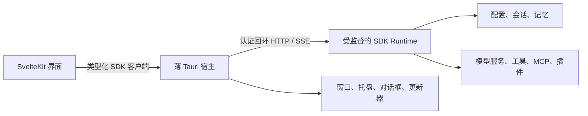

<p align="center">
  
</p>

<h1 align="center">OpenAgent</h1>

<p align="center">
  在你的工作区中处理文件、调用工具并持续执行任务的桌面 AI Agent。
</p>

<p align="center">
  <a href="README.md">English</a> · 简体中文<br />
  <a href="https://github.com/BANG404/openagent/releases">下载安装</a> ·
  <a href="CHANGELOG.md">更新日志</a> ·
  <a href="AGENTS.md">贡献指南</a>
</p>

OpenAgent 将流式聊天界面与能够阅读项目、编辑文件、执行命令和调用外部工具的 Agent 结合起来。你可以选择模型服务与工作区，在本机保存会话和应用数据，并通过技能、角色、MCP 服务及插件扩展能力。

桌面应用面向 Windows、macOS 和 Linux，界面采用 Svelte 5 与 SvelteKit 2，原生外壳采用 Tauri 2，Rust Runtime 由固定版本的私有 SDK 提供。项目仍在持续开发；公开的宿主仓库访问权限不包含私有 SDK 的访问权限。

## 可以做什么

| 能力 | 当前行为 |
| --- | --- |
| 处理项目文件 | 读取和修改文件、查看图片、执行终端命令，并跟踪交互式或后台终端会话。 |
| 持续完成复杂任务 | 委派子 Agent、复用专业角色、排队发送后续消息，并保留会话分支与压缩后的上下文。 |
| 安排后续执行 | 让 Agent 设置定时唤醒或支持的完成条件唤醒，并通过工具列出或取消待执行的 Hook。 |
| 审阅与恢复 | 查看工具调用和文件变更、回答结构化问题、按配置审批调用，并回滚文件或会话检查点。 |
| 阅读丰富输出 | 流式显示 Markdown、代码高亮、经过校验的 Mermaid 图、ECharts 图表、文件与链接胶囊、图片和视频；长回复可切换到书本阅读模式。 |
| 保留有用上下文 | 使用全局与工作区记忆、本地语义检索、可复用技能，以及用于标题、记忆和建议的后台 Flash 任务。 |
| 扩展 Agent | 连接 MCP 服务，安装提供命令、工具、技能、自动化、侧边栏或会话 UI 的 Agent 插件。 |
| 远程使用 | 接入支持的消息平台，或通过远程网关配对浏览器。 |

图片、PDF 和文本附件支持拖放、粘贴、预览、检查点恢复与分支编辑。实际模型及附件能力取决于所选服务与模型。

## 安装与开始使用

从 [GitHub Releases](https://github.com/BANG404/openagent/releases) 下载对应平台的安装包。请选择包含桌面安装包的发行版；仅组件发行版用于更新已有安装。

- **完整版（full）**：携带本地嵌入模型种子，适合首次安装。
- **轻量版**：在首次设置时下载并校验相同模型。桌面自动更新使用轻量产物，并保留已安装模型。

首次启动时，设置窗口会引导你完成偏好、模型服务、默认模型与资源准备。选择工作区文件夹，填写服务凭据和接口地址，验证连接，然后选择 Chat 与 Flash 模型。Chat 负责主对话，Flash 负责较小的后台任务。在配置可用聊天模型前，发送按钮保持禁用。

之后可通过顶部的**模型**菜单管理服务与默认模型。OpenAgent 支持 Anthropic、OpenAI 及兼容服务，也可填写自定义接口。OpenAI 兼容接口可以填写主机地址、`/v1` 根地址或完整的 `/chat/completions` 地址，应用会将其规范化为 API 根地址。

## 审批与执行权限

输入区提供审批模式选择器。顶部的**运行 → 执行与权限**分别配置工具审批和沙箱策略。

| 审批模式 | 行为 |
| --- | --- |
| 手动 | 工具调用需要审核，明确豁免的生命周期控制除外。 |
| 自动 | Flash 任务逐项评估调用；有重大影响或无法可靠判断的调用交由用户审核。 |
| 关闭 | 跳过审批流程执行调用。这是默认审批模式。 |

批准调用不会扩大文件系统或网络权限。默认的托管权限允许读取宿主文件系统、写入当前工作区，限制网络访问，并使宽泛可写目录下的 `.git`、`.agents` 与 `.codex` 保持只读。还可以选择只读预设或明确的路径规则。禁用隔离后，工具使用应用进程本身的访问权限。

托管终端在 Linux 上使用 Bubblewrap、macOS 上使用 Seatbelt、Windows 上使用固定版本的 Codex 沙箱；内置文件工具执行相同的文件权限策略。辅助程序缺失或沙箱准备失败时，执行会停止。完整规则见[权限说明](.agents/skills/openagent-configuration/references/permissions.md)。

## 技能、角色与插件

**技能（Skill）**是可复用的说明文件。全局技能放在 `~/.agents/skills/<名称>/SKILL.md`，项目技能放在 `<工作区>/.agents/skills/<名称>/SKILL.md`：

```markdown
---
name: python-review
description: 检查 Python 变更中的错误处理、类型注解和可维护性问题。
metadata:
  category: code-review
---

阅读变更代码，提供带文件位置的可执行建议。
优先关注错误行为、静默失败和缺失的错误处理。
```

技能采用渐进发现，相关时再加载完整说明。**角色（Role）**保存可复用的 Agent 工作流，可供会话选择或委派任务使用。

通过**集成 → 扩展**管理外部 MCP 服务，通过**集成 → 插件**浏览和管理 Agent 插件。官方目录包括 Goal、Graph、聊天组、Cua Driver、留言板和插件开发助手。插件可提供命令、MCP 工具、技能、生命周期自动化与嵌入式 UI；Cua Driver 提供桌面自动化，需要单独授予宿主访问权限。

Goal、Graph 和聊天组在各自包内管理工作流；子 Agent 协作属于 Runtime 能力。插件版本与更新独立于桌面版本。插件开发与本地源码配置见[插件开发技能](.agents/skills/openagent-plugin-development/SKILL.md)。

## 记忆与本地数据

应用配置与持久化数据使用统一根目录：

| 范围 | 位置 |
| --- | --- |
| 已安装应用 | 所有支持平台均为 `~/.openagent/` |
| 调试桌面 | `~/.openagent-dev/` |
| 显式应用根目录 | `OPENAGENT_HOME` 指定的目录 |
| 全局用户记忆 | `<OPENAGENT_HOME>/memory.md` |
| 工作区记忆 | `<工作区>/.agents/memory.md` |
| 全局／项目技能 | `~/.agents/skills/`／`<工作区>/.agents/skills/` |
| 工作区设计上下文 | `<工作区>/DESIGN.md` |

应用根目录保存 `config.toml`、会话 SQLite 数据库、附件、日志、已安装插件、插件数据与版本化资源。合法的外部配置修改会自动重新加载。持久化、备份与迁移由 Runtime 管理，详见[配置与应用数据](.agents/skills/openagent-configuration/references/data-and-startup.md)。

用户记忆提供持续有效的上下文；结构化 Agent 记忆独立保存，支持本地文本与向量混合检索。在**运行 → Flash 任务**中管理后台记忆任务与检索选项，自动检索默认关闭。**记忆**页面用于管理用户记忆和 Agent 记忆。

本地保存数据不代表模型请求离线执行：提示词、选中的上下文和附件会发送到配置的模型服务。MCP 服务与插件也可能访问各自配置的服务。

## 消息平台与浏览器访问

**集成 → 频道**支持飞书／Lark、Telegram、QQ、微信、Discord 和 Slack。每个联系人或频道会保留独立的持久会话，以及各自选择的工作区、模型和角色。目前消息频道支持文本，配置、允许列表和命令见[消息频道说明](.agents/skills/openagent-channel-integrations/references/messaging-channels.md)。

同一页面中的**网关（Gateway）**提供浏览器配对访问。启用后明确允许工作区，并使用页面显示的一次性配对码连接。在桌面保持运行时，远程用户可操作会话、附件、审批、提问与分支。远程访问和直接局域网访问默认关闭；模型服务管理及不受限制的桌面操作保留在本机。连接与安全边界见[远程网关说明](.agents/skills/openagent-channel-integrations/references/remote-gateway.md)。

## 更新与诊断

OpenAgent 提供 Beta、RC 与 Stable 更新频道。前端、受监督的 Runtime、原生外壳和已安装插件分别交付。组件在激活前完成校验，前端与 Runtime 激活支持回滚。更新会等待正在执行的 Agent 任务结束，原生外壳更新需要重启应用。详见[组件更新说明](.agents/skills/openagent-update-delivery/references/component-updates.md)。

宿主和 Runtime 的本地日志保存在 `<OPENAGENT_HOME>/logs`，每类滚动日志最多保留 15 个文件。经过隐私过滤的远程错误收集默认开启，可在**通用 → 隐私与诊断**中关闭；其中不包含会话内容、提示词、模型输出、工具参数、凭据或原始前端错误。可选的 Langfuse 模型追踪是独立通道，可能包含模型上下文，其环境变量见 [`.env.example`](.env.example)。详见[诊断说明](.agents/skills/openagent-configuration/references/diagnostics.md)。

## 从源码开发

### 环境要求

- Git，以及私有 `BANG404/openagent-sdk` 仓库的访问权限。SDK 子模块使用 SSH 地址，需要配置获得授权的 SSH 密钥。
- Bun **1.2.21**，与 `package.json` 及 CI 一致；还需 Node.js，以运行明确调用 `node` 的脚本。
- 当前稳定版 Rust 工具链及对应平台的 Tauri 2 原生构建依赖。Windows 需要 MSVC 构建工具和 WebView2；Linux 沙箱辅助程序构建还需要 `libcap` 开发头文件、`pkg-config` 与 GNU `strip`。

依赖版本由锁文件固定，Rust 使用与原生 CI 一致的稳定版工具链。开发准备见[本地命令说明](.agents/skills/openagent-release-engineering/references/local-commands.md)，Windows 另见[环境配置说明](.agents/skills/openagent-windows-development/references/setup-and-sync.md)。

```bash
git clone --recurse-submodules https://github.com/BANG404/openagent.git
cd openagent
bun run prepare:worktree:dev
bun tauri dev
```

准备命令会初始化固定版本的子模块、安装冻结依赖，并构建开发用沙箱辅助程序与 Runtime sidecar。已有检出目录使用相同命令准备。源码构建需要私有 SDK；没有权限的用户可安装已发布的桌面应用。

| 命令 | 用途 |
| --- | --- |
| `bun tauri dev` | 启动桌面、Vite 和受监督的外部 Runtime。 |
| `bun run dev` | 在可用回环端口启动纯前端开发，不提供桌面 Runtime。 |
| `bun run tauri:dev:embedded` | 显式启用嵌入式 Runtime 诊断模式。 |
| `bun run preflight` | 按实际变更文件选择并执行检查。 |
| `bun run preflight --dry-run` | 查看检查计划。 |
| `bun run tauri:build` | 构建轻量桌面安装包和更新产物。 |
| `bun run tauri:build:full` | 构建携带嵌入模型种子的首次安装包。 |

开发模式自动选择可用的 Vite 端口，并使用独立应用数据。启动器为不同工作树与数据夹具分配独立的原生开发构建目录，Runtime 与辅助程序产物仍在 `sdk/target`。SDK 源码修改会先重新构建 sidecar，再重启宿主。详见[开发 Runtime 刷新](.agents/skills/openagent-release-engineering/references/development-runtime.md)。

### 架构与目录


```mermaid
flowchart LR
  UI["SvelteKit 界面"] -->|"类型化 SDK 客户端"| Host["薄 Tauri 宿主"]
  Host -->|"认证回环 HTTP / SSE"| Runtime["受监督的 SDK Runtime"]
  Host --> Native["窗口、托盘、对话框、更新器"]
  Runtime --> Data["配置、会话、记忆"]
  Runtime --> Tools["模型服务、工具、MCP、插件"]
```

| 路径 | 职责 |
| --- | --- |
| `src/` | Svelte 路由、功能控制器、组件、本地化与流式内容渲染。 |
| `src-tauri/` | 原生宿主适配、资源协议、进程监督与打包。 |
| `sdk/` | 固定版本的私有 Runtime 与类型化传输／客户端源码。 |
| `plugins/` | 固定版本的独立插件仓库与本地开发索引。 |
| `scripts/`、`tests/` | 环境准备、检查、发布自动化与确定性验证。 |
| `.agents/skills/` | 按领域组织的架构约定与贡献流程。 |

宿主保持轻量，运行时状态机和持久数据由 SDK 管理。公开前端与宿主可独立贡献，完整源码构建仍需要固定的私有依赖。

### 参与贡献

编辑前阅读 [`AGENTS.md`](AGENTS.md) 和适用领域的技能。仓库变更使用[隔离 OWT 工作树](.agents/skills/deliver-via-owt/SKILL.md)：默认目录留在本地 `master`，在任务工作树实现和验证，再将验证结果快进合入。提交前检查完整差异、暂存目标文件，并执行 `bun run preflight`；提交采用 Conventional Commits。

行为变化需要同步更新主要归属文档。可见桌面变化还需执行对应的真实窗口[原生黑盒场景](.agents/skills/openagent-desktop-host/references/native-verification.md)。修改 SDK 或插件时，先遵循各自仓库说明，再推进父仓库 gitlink。

Runtime 真模型检查遵循 SDK 内部说明，环境变量模板见 [`.env.example`](.env.example)。`bun run test:sonar` 在向本地配置的 SonarQube 提交分析前，执行宿主与 SDK 测试门禁。

## 许可证

OpenAgent 提供 [GPL-3.0-or-later](LICENSE) 许可和单独的[商业许可选项](COMMERCIAL_LICENSE.md)。商业权利需通过书面协议获得。项目名称与品牌遵循 [TRADEMARKS.md](TRADEMARKS.md)。
